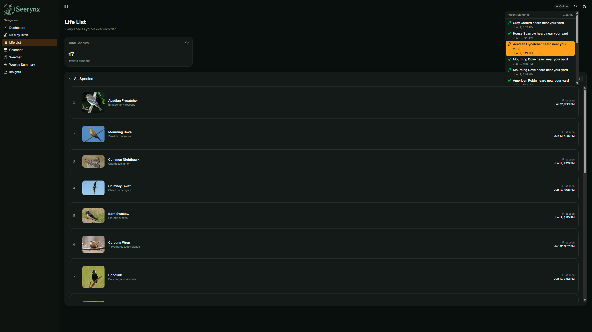
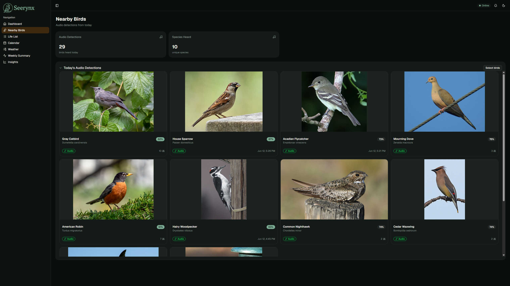
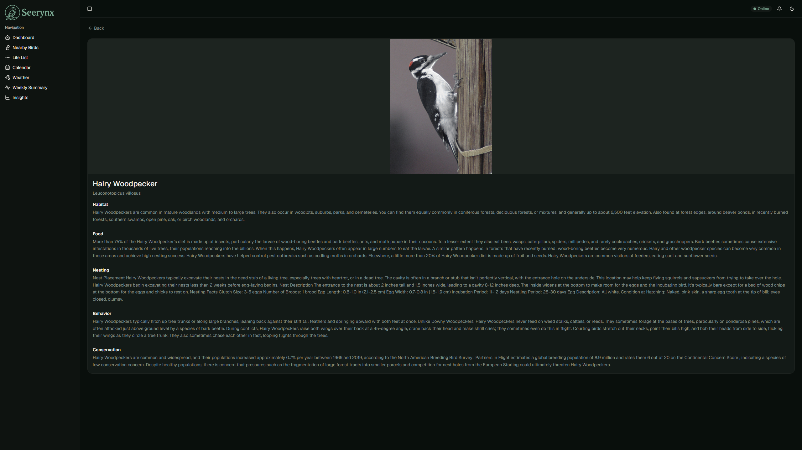
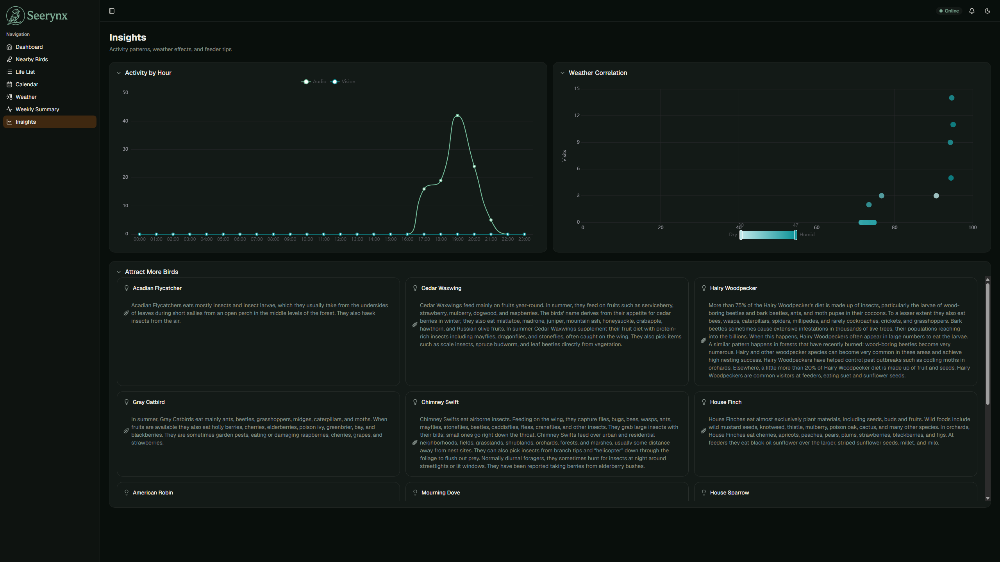

<p align="center">
  
</p>

# Seerynx: The Backyard Bird Sentinel

Seerynx is a self-hosted bird monitoring system for a Raspberry Pi-based bird
feeder. A camera and microphone on the feeder detect and identify birds in
real time (vision + audio), log sightings and weather to a database, and
surface everything through a web dashboard — life list, calendar, weekly
summaries, weather correlation, and a feeder online/offline indicator.

## Features

- **Vision detection** — EfficientDet-Lite0 for animal pre-filtering, AIY
  Birds V1 for species classification, with photo capture of sightings.
- **Audio detection** — BirdNET-based identification of nearby birds from
  ambient audio.
- **Weather logging** — DHT22 temperature/humidity readings correlated with
  sightings.
- **Dashboard** — life list, calendar heatmap, visit streaks, weekly
  summaries, "attract more birds" suggestions, and insights/correlation
  charts.
- **Feeder online/offline status** — live websocket indicator in the header.
- **Notifications** — in-app notification bell for new sightings.

## Screenshots

<p align="center">
  
  
  
  
</p>

## Architecture 
TODO: make an actual diagram
```
┌───────────────┐   MQTT    ┌───────────────┐   HTTPS    ┌──────────────┐
│ Feeder (RPi)  ├──────────►│  Inference    ├───────────►│   API        │
│ camera/audio/ │ paho-mqtt │  (EfficientDet│  httpx +   │  (FastAPI +  │
│ weather/      │           │  AIY Birds V1 │  X-API-Key │  PostgreSQL) │
│ heartbeat     │           │  BirdNET)     │            │              │
└───────────────┘           └───────────────┘            └──────┬───────┘
                                                                │
                                                         REST + WebSocket
                                                                │
                                                         ┌──────▼────────┐
                                                         │  Frontend     │
                                                         │  (React, via  │
                                                         │  nginx)       │
                                                         └───────────────┘
```

- **`feeder/`** — runs on the Raspberry Pi. Captures camera frames, audio
  chunks, and DHT22 weather readings, and publishes them to MQTT topics.
  Also publishes a periodic heartbeat.
- **`inference/`** — subscribes to the feeder's MQTT topics, runs ML
  inference, and POSTs results to the API.
- **`api/`** — FastAPI service backed by PostgreSQL. Stores sightings,
  species info, and weather; serves the REST API and the feeder
  online/offline WebSocket.
- **`frontend/`** — React (TanStack Router/Query) dashboard, served by nginx,
  which also reverse-proxies `/api/` to the API.

## Data Requirements

### Species reference data (`species_info` table)

The dashboard's life list, species pages, and "attract more birds"
suggestions depend on a `species_info` table being populated. Seed it with a
JSON file shaped like this, keyed by **common name**:

```json
{
  "American Robin": {
    "scientific": "Turdus migratorius",
    "ebird_code": "amerob",
    "habitat": "Open woodlands, gardens, and lawns",
    "food": "Earthworms, insects, fruit, berries",
    "nesting": "Cup nest in trees or shrubs, 3-5 eggs",
    "behavior": "Forages on the ground, often seen hopping across lawns",
    "conservation": "Low concern",
    "category": "species"
  },
  "Emu": {
    "scientific": "Dromaius novaehollandiae",
    "ebird_code": "emu1",
    "habitat": null,
    "food": null,
    "nesting": null,
    "behavior": null,
    "conservation": null,
    "category": "species"
  }
}
```

| Field | Type | Required | Notes |
|---|---|---|---|
| (key) | string | yes | Common name — must match the names produced by your inference models (`scientific_name` from the AIY Birds labelmap / BirdNET output is resolved against this table). |
| `scientific` | string \| null | no | Maps to `scientific_name`. |
| `ebird_code` | string \| null | no | Used as the filename stem for species photos (see below). |
| `habitat`, `food`, `nesting`, `behavior`, `conservation` | string \| null | no | Free-text, shown on the species detail page. |
| `category` | string \| null | no | e.g. `"species"`; used to filter non-species taxa out of UI lists. |

Load this into PostgreSQL via `INSERT ... ON CONFLICT (common_name) DO UPDATE`
against the `species_info` table (see `api/models/orm.py` for the full
column list, including `foods_list`, `feeder_types`, `notes`, and
`photo_path`, which are optional and can be populated separately).

### Species photos

`species_info.photo_path` is a path relative to `PHOTOS_DIR` (e.g.
`species/amerob.jpg`), served by the API at `GET /api/photos/{path}`. Place
images at `PHOTOS_DIR/species/<file>` and set `photo_path` accordingly.

### Sighting photos

Sightings posted by the inference service (`POST /api/sightings`) include a
`photo_path` relative to `PHOTOS_DIR`, written by the inference container to
its shared `photos` volume.

### Required ML model files

`inference/` expects the following files under `MODELS_DIR` (default
`/app/models`, mounted from the `seerynx-models` PVC in k8s) — none of these
are checked into the repo:

| File | Source |
|---|---|
| `birds_v1.tflite` | "Aiy / Vision / Classifier / Birds V1" model from TensorFlow Hub / Kaggle Models. |
| `aiy_birds_V1_labelmap.csv` | Labelmap accompanying the AIY Birds V1 model (columns: `id`, `name` — scientific names). |
| `efficientdet_lite0.tflite` | "EfficientDet-Lite0" object detection model from TensorFlow Hub / Kaggle Models, used to pre-filter frames for animal presence before running classification. |

BirdNET's model is bundled with the `birdnet` Python package and needs no
separate download.

## Prerequisites

- A Kubernetes cluster (this project targets **k3s** with **Traefik** ingress
  and the **CloudNativePG** operator for PostgreSQL).
- `kubectl`, `kustomize` (or `kubectl apply -k`), `podman`, and `make`.
- A container registry reachable from the cluster (the Makefile assumes a
  local/private registry).
- A reverse proxy in front of the cluster for TLS termination — this project
  is documented against **Nginx Proxy Manager**, but any TLS-terminating
  proxy works.
- Raspberry Pi feeder hardware: Pi Camera, USB microphone, DHT22 sensor on a
  GPIO pin.

## Installation & Deployment

### 1. Configure environment

```bash
cp .env.template .env
```

Fill in `.env`:

| Variable | Description |
|---|---|
| `SEERYNX_API_KEY` | Shared secret for all internal service-to-service calls (`X-API-Key` header). Generate with `python3 -c "import secrets; print(secrets.token_hex(32))"`. |
| `POSTGRES_PASSWORD` | Password for the `seerynx` Postgres role. |
| `MQTT_PASSWORD` | Password for the `seerynx` MQTT user. |
| `ALLOWED_ORIGINS` | CORS origins allowed to call the API, e.g. `https://seerynx.local,http://localhost:5173`. |
| `ALLOWED_HOSTS` | Hosts the API will accept (`TrustedHostMiddleware`), e.g. `seerynx.local`. |
| `VITE_API_URL` | Public URL the browser uses to reach the API, e.g. `https://seerynx.local`. |
| `OPENAPI_API_KEY` | Used only at build time to fetch `openapi.json` for client codegen — not shipped to the browser. |
| `VITE_DISPLAY_TIMEZONE` | IANA timezone for displaying timestamps, e.g. `America/New_York`. |
| `DISPLAY_TIMEZONE` (API, `k8s/api.yaml`) | IANA timezone the API uses to compute "today" for `/today`, `/nearby`, `/calendar`, `/streak`, and `/attract`. Should match `VITE_DISPLAY_TIMEZONE`. Defaults to `UTC`. |
| `API_INTERNAL_URL` | URL the frontend build container uses to reach the API for codegen (e.g. `http://seerynx.local` via `--add-host`). |
| `CLUSTER_IP` | IP of a cluster node, used for `NetworkPolicy` allow-lists and `/etc/hosts` entries. |
| `FEEDER_IP` | Static IP of the Raspberry Pi feeder, used in `NetworkPolicy`. |
| `REGISTRY`, `REGISTRY_USER`, `REGISTRY_PASSWORD` | Your container registry credentials. |

### 2. Build and push images

```bash
make login           # log into your registry
make build-backend   # builds seerynx-api and seerynx-inference
make build-frontend  # builds seerynx-frontend (embeds VITE_* config)
make push-backend
make push-frontend
```

### 3. Create cluster secrets

```bash
make secrets
```

This creates:
- `postgres-credentials` (DB user/password/connection string)
- `seerynx-secrets` (`api-key`, `mqtt-password`)
- `mosquitto-passwd` (MQTT broker password file)
- `local-registry-secret` (image pull secret)

> **Prerequisite:** the CloudNativePG operator must already be installed in
> the cluster, since `k8s/postgres.yaml` is a `postgresql.cnpg.io/v1
> Cluster` resource.

### 4. Deploy

```bash
make deploy
```

This renders `__CLUSTER_IP__`, `__FEEDER_IP__`, and `__REGISTRY__`
placeholders in `k8s/*.yaml` from your `.env` values and applies everything
via Kustomize.

### 5. Run the full pipeline

```bash
make all
```

Runs build → push → deploy → rollout-restart for both backend and frontend,
waiting for each to become healthy.

### 6. Seed species data and ML models

Before the dashboard is useful:
- Load `species_info` (see [Data Requirements](#data-requirements)) into the
  Postgres database.
- Copy the ML model files into the `seerynx-models` PVC (e.g. via `kubectl
  cp` to a temporary pod, or an init job).

### 7. Configure ingress / reverse proxy

`k8s/ingress.yaml` is a Traefik `Ingress` routing `seerynx.local` →
`seerynx-frontend:80`. To expose this externally with TLS via **Nginx Proxy
Manager**:

1. Add a DNS entry (or `/etc/hosts` entry) pointing `seerynx.local` at your
   cluster's IP.
2. In NPM, add a **Proxy Host**:
   - Domain: `seerynx.local`
   - Forward to: `http://<cluster-ip>:80` (the Traefik `web` entrypoint /
     NodePort)
   - Enable a custom or Let's Encrypt SSL certificate for HTTPS.
3. Ensure NPM passes through WebSocket upgrades (Proxy Hosts have a
   "Websockets Support" toggle) — required for the feeder status indicator.

### 8. Set up the feeder (Raspberry Pi)

```bash
sudo cp feeder/feeder.env.template /etc/seerynx/feeder.env
# edit /etc/seerynx/feeder.env with MQTT_HOST/PORT/PASSWORD
```

Run `feeder/main.py` (e.g. as a systemd service) with `uv sync` to install
dependencies. It expects:
- A Pi Camera (via `picamera2`)
- A USB microphone (auto-detected via `arecord -l`, or set `AUDIO_DEVICE`)
- A DHT22 sensor on GPIO17 (configurable via `WEATHER_PIN`)
- `efficientdet_lite0.tflite` under `MODELS_DIR` (default `./models`) for the
  animal pre-check before publishing camera frames.

## Configuration Guide

### MQTT topics

| Topic | Publisher | Consumer | Payload |
|---|---|---|---|
| `feeder/camera/frame` | feeder | inference | JPEG frame |
| `feeder/audio/chunk` | feeder | inference | audio chunk |
| `feeder/weather` | feeder | inference | `{"temperature_c": float, "humidity": float}` |
| `feeder/status/heartbeat` | feeder | inference | `{"status": "online"}`, every `HEARTBEAT_INTERVAL` seconds (default 15s) |

### Key API endpoints

All endpoints (except `/api/health`) require an `X-API-Key` header matching
`SEERYNX_API_KEY`.

| Endpoint | Purpose |
|---|---|
| `GET /api/sightings`, `/api/sightings/today`, `/api/sightings/nearby` | Recent sightings (all / camera / audio). |
| `GET /api/sightings/heatmap`, `/streak`, `/first`, `/calendar` | Dashboard analytics. |
| `POST /api/sightings` | Ingest a sighting (used by `inference`). |
| `GET /api/species/{common_name}` | Species reference info. |
| `GET /api/species/by-scientific-name/{scientific_name}` | Species reference info, looked up by scientific name (used by `inference` to resolve detections). |
| `GET /api/weather`, `/api/weather/correlation` | Weather history and sighting correlation. |
| `POST /api/weather` | Ingest a weather reading (used by `inference`). |
| `GET /api/attract` | Suggestions for species heard nearby but not yet visiting. |
| `GET /api/summary/weekly` | Weekly visit/species counts. |
| `GET /api/photos/{path}` | Serve a sighting or species photo. |
| `POST /api/devices/feeder/heartbeat` | Record a feeder heartbeat (used by `inference`). |
| `GET /api/devices/feeder/ws` | WebSocket — pushes `{"online": bool, "last_heartbeat": iso}` on connect and on status change. |
| `GET /api/health`, `/api/health/models` | Liveness/readiness and ML model load status. |

### Tunable environment variables

| Service | Variable | Default | Purpose |
|---|---|---|---|
| `inference`/`api` | `DETECTION_THRESHOLD`, `CLASSIFICATION_THRESHOLD`, `BIRDNET_THRESHOLD` | `0.5`, `0.3`, `0.7` | Confidence thresholds for vision/audio detections. |
| `feeder` | `HEARTBEAT_INTERVAL` | `15` | Seconds between feeder heartbeats. The API considers the feeder offline after ~3x this interval (45s). |
| `feeder` | `CAMERA_WIDTH`, `CAMERA_HEIGHT`, `CAMERA_FRAMERATE` | `1920`, `1080`, `10` | Camera capture resolution and framerate. |
| `feeder` | `MOTION_THRESHOLD`, `MOTION_MIN_AREA`, `MOTION_SUSTAIN_FRAMES`, `MOTION_COOLDOWN`, `BURST_COUNT` | `25`, `1500`, `3`, `10`, `3` | Motion-detection tuning for camera capture. |
| `feeder` | `WEATHER_INTERVAL` | `300` | Seconds between DHT22 readings. |

## Local Development

### Frontend

```bash
cd frontend
npm install
npm run dev   # requires VITE_API_URL etc. set in ../.env (envDir is repo root)
```

### API

```bash
cd api
uv sync
SEERYNX_API_KEY=... DATABASE_URL=postgresql+asyncpg://... uv run uvicorn main:app --reload
```

## License

MIT — see [LICENSE](LICENSE).
